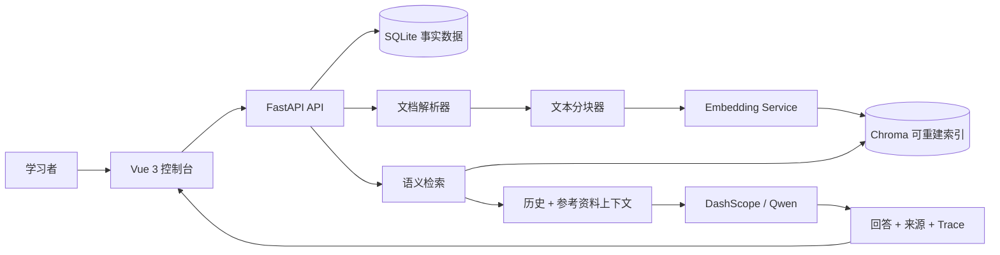

# KnowFlow 知汇

> 面向大数据课程学习的可追溯 RAG 知识库。把分散的课程资料变成可以检索、提问和复查来源的学习系统。

KnowFlow 是一个本地单用户的课程知识库问答应用，覆盖文档上传、内容解析、文本分块、语义向量检索、通义千问生成、引用展示和检索过程追踪。它的重点不是“让模型自由聊天”，而是让回答尽量回到用户自己的课程资料。

## 当前状态

当前分支已经完成一次全面代码审查和稳定性加固：

- 使用 DashScope `text-embedding-v3` 进行语义 embedding；没有有效 API Key 时保留 deterministic hashing fallback，方便离线开发和测试。
- 多轮会话会把最近历史送入 LLM，并使用历史中的最近用户问题辅助指代消解。
- 每条回答返回引用片段、相似度分数、检索 trace 和 token 使用量。
- 上传采用分块落盘和大小限制；解析、分块、embedding、Chroma 写入移出事件循环线程。
- SQLite 是事实数据源，Chroma 是可重建索引；支持知识库级索引重建。
- 后端 18 项 pytest、前端 2 项 Vitest、Ruff、Vite build 和依赖审计已接入 GitHub Actions。

远端仓库：[LBStruggleee/KnowFlow](https://github.com/LBStruggleee/KnowFlow)
当前加固分支：[codex/comprehensive-hardening](https://github.com/LBStruggleee/KnowFlow/tree/codex/comprehensive-hardening)
最新 PR：[feat: harden KnowFlow RAG pipeline and add CI](https://github.com/LBStruggleee/KnowFlow/pull/1)

## 能做什么

### 学习资料管理

- 创建、重命名和分类管理多个知识库。
- 上传 `.txt`、`.md`、`.pdf`、`.docx`、`.pptx` 文件。
- 自动提取正文和表格文本，按段落感知规则切分 chunk。
- 查看文档状态、内容预览、chunk 数和分块内容。
- 删除文档或知识库，并清理关联的会话、文件和向量。
- 在索引异常或切换 embedding 模型后重建知识库索引。

### RAG 问答

- 基于语义 embedding 检索相关课程片段。
- 支持多轮上下文，历史窗口受消息数和字符数双重限制。
- 回答严格要求基于参考资料；资料中的指令会被视为不可信内容。
- 展示引用来源、chunk、分数、请求 Top K、返回数量和阈值判断。
- 支持配置检索数量、分数阈值、Qwen 模型和生成温度。

### 工程能力

- 结构化服务端日志和失败堆栈。
- 上传大小限制、外部 API 超时、输入 trim 和路径安全检查。
- SQLite 外键约束与事务处理，Chroma 外部资源失败时有补偿清理。
- GitHub Actions 自动执行后端/前端测试、静态检查、构建和依赖审计。

## 架构



设计上的数据边界：SQLite 保存知识库、文档、chunk、会话和消息；Chroma 只保存可通过 SQLite chunk 重建的向量索引。删除、模型切换或索引异常时，优先保证 SQLite 事实数据，再清理或重建外部资源。

## 技术栈

| 层 | 技术 |
| --- | --- |
| 前端 | Vue 3、Vite、Element Plus、Axios、Markdown It |
| 后端 | FastAPI、SQLAlchemy、Pydantic |
| 元数据 | SQLite |
| 向量索引 | Chroma PersistentClient |
| LLM / Embedding | DashScope OpenAI-compatible API、Qwen、`text-embedding-v3` |
| 文档解析 | pypdf、python-docx、python-pptx、TXT/Markdown reader |
| 测试 | pytest、Vitest |
| 工程检查 | Ruff、pip-audit、npm audit、GitHub Actions |

## 项目结构

```text
KnowFlow/
├── backend/
│   ├── app/
│   │   ├── api/             # REST API：知识库、文档、搜索、聊天、管理
│   │   ├── core/            # 配置、数据库和 SQLite 外键设置
│   │   ├── models/          # SQLAlchemy 数据模型
│   │   ├── schemas/         # Pydantic 输入/输出模型
│   │   └── services/        # parser、chunker、embedding、vector、RAG、LLM
│   ├── tests/               # 单元测试和 API 冒烟测试
│   ├── storage/             # 本地上传文件和 Chroma 数据，已被 gitignore
│   ├── requirements.txt     # 运行依赖
│   └── requirements-dev.txt # 测试、lint 和审计工具
├── frontend/
│   ├── src/
│   │   ├── api/             # Axios API client
│   │   ├── components/      # 局部 UI 组件
│   │   ├── utils/           # 可测试的前端纯函数
│   │   ├── App.vue          # 当前控制台外壳和页面状态
│   │   └── style.css        # 全局视觉样式
│   └── package.json
├── docs/                    # UML、工程计划、评审清单和深度审查报告
├── .github/workflows/ci.yml # GitHub Actions
└── README.md
```

## 快速启动

### 1. 后端

需要 Python 3.13。

```powershell
cd D:\bruce\KnowFlow\backend
python -m venv .venv
.\.venv\Scripts\Activate.ps1
pip install -r requirements.txt
Copy-Item .env.example .env
```

编辑 `backend/.env`：

```env
DASHSCOPE_API_KEY=your_dashscope_api_key
EMBEDDING_PROVIDER=dashscope
EMBEDDING_MODEL=text-embedding-v3
EMBEDDING_BATCH_SIZE=10
QWEN_BASE_URL=https://dashscope.aliyuncs.com/compatible-mode/v1
QWEN_MODEL=qwen-plus
LLM_TIMEOUT_SECONDS=60
HISTORY_MAX_MESSAGES=20
HISTORY_MAX_CHARS=16000
UPLOAD_MAX_BYTES=52428800
CORS_ORIGINS=http://127.0.0.1:5173,http://localhost:5173
```

启动 API：

```powershell
uvicorn app.main:app --reload --host 127.0.0.1 --port 8000
```

检查服务：

- Health：<http://127.0.0.1:8000/api/health>
- Swagger：<http://127.0.0.1:8000/docs>

没有有效 `DASHSCOPE_API_KEY` 时，embedding 会自动降级到本地 hashing 实现，但真实问答仍需要配置 LLM API Key。

### 2. 前端

```powershell
cd D:\bruce\KnowFlow\frontend
npm install
Copy-Item .env.example .env.local
npm run dev -- --host 127.0.0.1 --port 5173
```

默认 `frontend/.env.example`：

```env
VITE_API_BASE=http://127.0.0.1:8000
```

打开 <http://127.0.0.1:5173/>。

## 质量检查

安装开发依赖：

```powershell
cd D:\bruce\KnowFlow
cd backend
.\.venv\Scripts\Activate.ps1
pip install -r requirements-dev.txt
$env:PYTHONPATH = "."
pytest tests -q
ruff check .
ruff format --check .
python -m compileall -q app
pip check
pip-audit -r requirements.txt --ignore-vuln PYSEC-2026-311
```

执行前端检查：

```powershell
cd D:\bruce\KnowFlow\frontend
npm test
npm run build
npm audit --audit-level=high
```

GitHub Actions 会在 push 和 pull request 时执行同类检查。当前验证基线为后端 18 项、前端 2 项测试全部通过。

## 主要 API

| 方法 | 路径 | 作用 |
| --- | --- | --- |
| `GET` | `/api/health` | 服务、embedding provider 和 collection 健康信息 |
| `GET/POST/PATCH/DELETE` | `/api/kbs` | 知识库 CRUD |
| `POST` | `/api/kbs/{kb_id}/documents/upload` | 上传并处理文档 |
| `GET` | `/api/kbs/{kb_id}/documents` | 查看知识库文档和 chunk 数 |
| `GET` | `/api/documents/{document_id}/chunks` | 查看文档分块 |
| `DELETE` | `/api/documents/{document_id}` | 删除文档及其索引 |
| `POST` | `/api/kbs/{kb_id}/search` | 直接执行向量检索 |
| `POST` | `/api/chat` | 执行带历史上下文的 RAG 问答 |
| `GET/POST/DELETE` | `/api/conversations` | 会话列表、详情和删除 |
| `GET/PATCH` | `/api/admin/settings` | 检索和生成参数 |
| `GET` | `/api/admin/status` | 系统统计与 token 用量 |
| `POST` | `/api/kbs/{kb_id}/rebuild-index` | 从 SQLite chunk 重建 Chroma 索引 |

问答示例：

```http
POST /api/chat
Content-Type: application/json

{
  "kb_id": 1,
  "question": "RAG 的核心流程是什么？",
  "conversation_id": null
}
```

向量检索示例：

```http
POST /api/kbs/1/search
Content-Type: application/json

{
  "query": "文本分块有什么作用？",
  "top_k": 3
}
```

## Embedding 与索引迁移

embedding 模型或 provider 会参与 Chroma collection 命名。切换模型后，旧 collection 不会被错误复用；需要对每个知识库执行：

```http
POST /api/kbs/{kb_id}/rebuild-index
```

重建过程会从 SQLite 中现有的 `DocumentChunk` 重新生成向量。上传资料不会因为 Chroma 索引损坏而丢失，但索引清理失败时应查看服务端日志并执行重建。

## 安全与部署边界

当前项目是本地单用户应用：

- 默认后端只监听 `127.0.0.1`。
- 当前没有用户认证、授权和限流。
- 不要把后端或 Chroma 数据目录直接暴露到公网。
- API Key 只放在 `backend/.env`，不要提交到 Git。
- `UPLOAD_MAX_BYTES` 默认 50 MiB；解析器和上传处理仍应在受控环境运行。

若要用于公网或多用户场景，必须先补充认证/授权、租户隔离、限流、后台任务队列、数据库迁移和审计日志。

## 文档与路线图

- [代码评审与改进清单](docs/代码评审与改进清单.md)：按优先级记录问题、执行进度和验收标准。
- [深度代码审查报告](docs/深度代码审查报告.md)：本轮稳定性、安全、依赖和架构审查结论。
- [工程化推进计划书](docs/工程化推进计划书.md)：后续工程化方向。

下一阶段：

1. 后台任务队列和可观测的 `processing → finished/failed` 状态流。
2. SSE 流式回答、请求取消和有限重试。
3. 拆分剩余 `App.vue` 管理视图，按需加载 Element Plus，降低首屏 bundle。
4. Alembic 数据库迁移、用户认证授权和知识库权限。
5. 建立 Recall@K、MRR、拒答准确率和同义改写稳定性的 RAG 评测集。
6. Docker 部署和生产环境配置模板。

## License

当前项目用于课程实践和作品展示。
