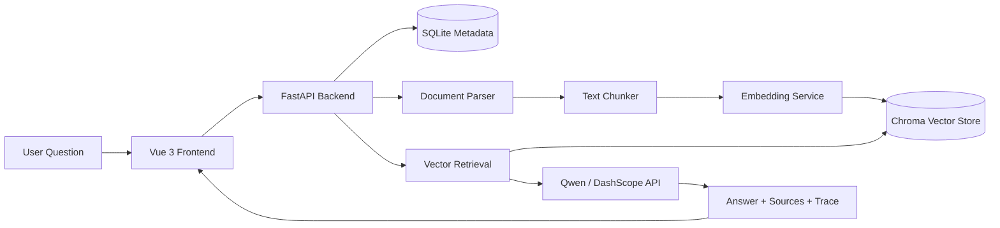

# KnowFlow 知汇

> A course-aware RAG console that turns scattered learning materials into a searchable, traceable knowledge system.

KnowFlow（知汇）是一个面向大数据专业课程学习的 RAG 知识库问答系统。它不是一个单纯的聊天页面，也不是一个普通的文件搜索工具，而是把“课程资料管理、文档解析、文本分块、向量检索、千问生成、引用溯源”串成了一条完整的工程链路。

项目的目标很直接：让 PDF、Word、PPT、Markdown、实验指导书和课堂笔记不再散落在文件夹里，而是变成一个可以被提问、被检索、被验证来源的个人课程知识库。

## Why KnowFlow

大数据专业的学习资料往往不是少，而是太散。

一门课可能同时有课件、实验文档、教材截图、网上博客、老师发的 Word 文件和自己整理的笔记。真正遇到问题时，学生经常不是不知道学过，而是不知道答案藏在哪份资料里。

普通关键词搜索只能“找原文”，通用大模型又容易给出脱离课程资料的泛化回答。KnowFlow 想解决的是两者之间的缺口：

- 能理解自然语言问题，而不是只匹配关键词
- 回答必须基于上传的资料，而不是凭空生成
- 每个回答都能回到引用片段，方便复查和答辩
- 资料可以持续积累，逐步形成自己的专业知识库

## What It Does

KnowFlow 当前 MVP 已经实现了完整 RAG 问答闭环：

1. 创建不同主题的知识库
2. 上传课程资料
3. 自动解析文档内容
4. 将文本切分为 chunk
5. 使用 DashScope `text-embedding-v3` 生成语义 embedding 并写入 Chroma
6. 根据问题进行向量检索
7. 调用阿里云百炼 / 通义千问生成回答
8. 返回答案、引用源、检索过程和 token 使用情况

支持的文档格式：

```text
.txt
.md
.pdf
.docx
.pptx
```

## Product Highlights

- **RAG 首页优先**：打开系统后首先进入问答界面，知识库管理作为附页，符合真实使用路径。
- **多知识库切换**：不同知识库在问答输入框中以“数据库模型”的形式展示，类似模型选择器。
- **引用源可视化**：回答不是孤立文本，可以查看命中的 chunk、分数和来源文档。
- **文档全链路处理**：上传后自动完成解析、分块、向量化、入库。
- **管理闭环**：支持知识库创建、重命名、分类修改、文档删除、知识库维护。
- **工程化扩展**：加入历史会话、系统状态、检索参数设置、token 使用统计、检索 trace。
- **简历友好**：覆盖 FastAPI、Vue、向量数据库、LLM API、RAG pipeline、文档解析等完整技术面。

## Architecture



## Tech Stack

| Layer | Tech |
| :--- | :--- |
| Frontend | Vue 3, Vite, Element Plus |
| Backend | FastAPI, SQLAlchemy, Pydantic |
| Database | SQLite |
| Vector Store | Chroma |
| LLM | Alibaba Cloud Bailian / DashScope / Qwen |
| Parsing | Markdown, TXT, PDF, DOCX, PPTX parsers |
| RAG Flow | Chunking, Embedding, Vector Search, Source Trace |

## Project Structure

```text
KnowFlow/
├── backend/                 # FastAPI backend
│   ├── app/
│   │   ├── api/             # API routes
│   │   ├── core/            # config and database
│   │   ├── models/          # SQLAlchemy models
│   │   ├── schemas/         # Pydantic schemas
│   │   └── services/        # parser, chunker, vector store, RAG, LLM
│   ├── storage/             # local runtime storage, ignored by git
│   ├── requirements.txt     # runtime dependencies
│   └── requirements-dev.txt # test, lint, and audit tools
├── frontend/                # Vue frontend
│   ├── src/
│   │   ├── api/             # API client
│   │   ├── App.vue          # main console UI
│   │   └── style.css
│   └── package.json
├── docs/                    # project docs and UML notes
└── README.md
```

## Quick Start

### 1. Backend

```powershell
cd D:\bruce\KnowFlow\backend
python -m venv .venv
.\.venv\Scripts\Activate.ps1
pip install -r requirements.txt
Copy-Item .env.example .env
```

Edit `backend/.env`:

```env
DASHSCOPE_API_KEY=your_dashscope_api_key
EMBEDDING_PROVIDER=dashscope
EMBEDDING_MODEL=text-embedding-v3
QWEN_BASE_URL=https://dashscope.aliyuncs.com/compatible-mode/v1
QWEN_MODEL=qwen-plus
```

Run:

```powershell
uvicorn app.main:app --reload --host 127.0.0.1 --port 8000
```

Check:

```text
http://127.0.0.1:8000/api/health
http://127.0.0.1:8000/docs
```

### 2. Frontend

```powershell
cd D:\bruce\KnowFlow\frontend
npm install
npm run dev -- --host 127.0.0.1 --port 5173
```

Open:

```text
http://127.0.0.1:5173/
```

### 3. Quality checks

```powershell
pip install -r backend/requirements-dev.txt
$env:PYTHONPATH = "backend"
pytest backend/tests -q
ruff check backend
ruff format --check backend

cd frontend
npm test
npm run build
npm audit
```

GitHub Actions 会在每次 push 和 pull request 时执行同样的测试、构建、静态检查与依赖审计。

## Core API Examples

Ask a RAG question:

```http
POST /api/chat
Content-Type: application/json

{
  "kb_id": 1,
  "question": "RAG 的核心流程是什么？",
  "top_k": 5
}
```

Vector search:

```http
POST /api/kbs/{kb_id}/search
Content-Type: application/json

{
  "query": "文本分块有什么作用？",
  "top_k": 3
}
```

## Screens To Notice

- **RAG 问答首页**：主输入框、数据库选择器、上传入口、发送按钮。
- **知识库管理附页**：文档上传、知识库维护、文档列表、分块预览。
- **检索过程**：展示 top-k、阈值、最高分、命中片段。
- **引用源**：显示回答依据，避免大模型“只给结论不讲出处”。

## Roadmap

- Add reranking for better retrieval quality
- Add SSE streaming responses and background document jobs
- Split the remaining management views into route-level Vue components
- Add document-level permission and user accounts
- Add batch import from web pages or course folders
- Add evaluation set for retrieval and answer quality
- Add deployment scripts with Docker

## Notes

Runtime files are intentionally ignored:

- `.env`
- local SQLite database
- Chroma vector data
- uploaded documents
- virtual environments
- `node_modules`

This keeps the repository clean and safe while preserving the full source code needed to rebuild the project.

KnowFlow 当前默认是本地单用户应用，没有身份认证。请保持后端监听在 `127.0.0.1`；在增加认证、授权和限流前，不应直接暴露到公网。

## License

This project is currently for coursework and portfolio demonstration.
