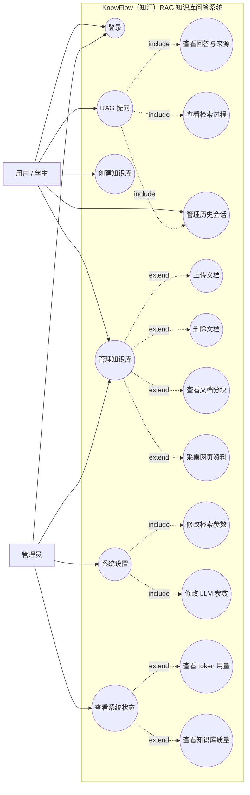
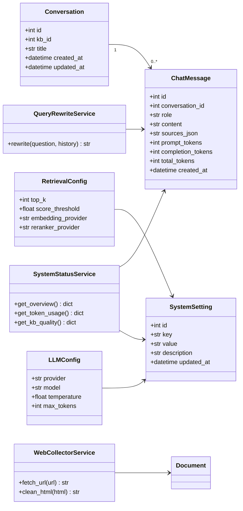
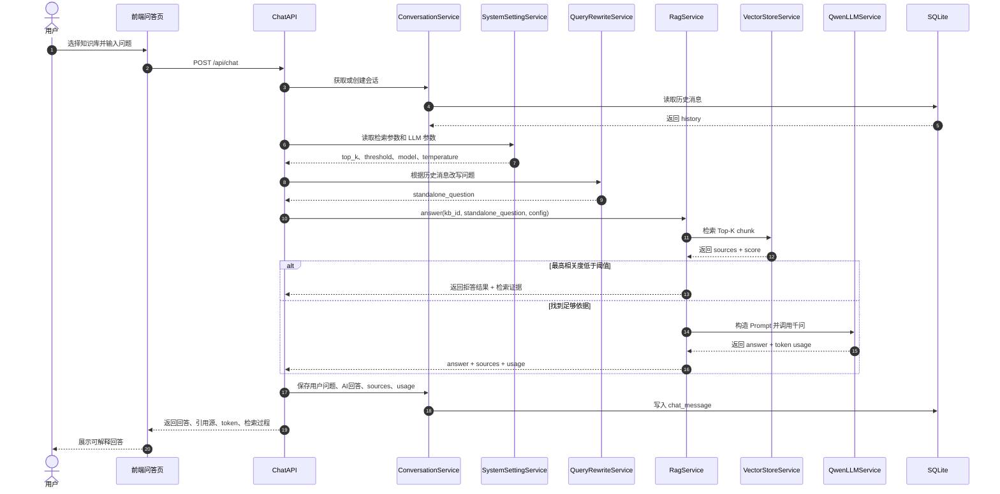

# KnowFlow（知汇）作业要求对照与创新扩展方案

本文档基于《信息系统分析与设计》项目作业中 1.1 RAG 系统要求整理，用于说明 KnowFlow 当前 MVP 与基础用例图的对应关系，并规划必要扩展和创新点。

## 1. 作业要求提炼

作业选择方向为：

```text
1.1 RAG 系统：基于 RAG 技术，实现一个面向特定领域的知识问答系统。
```

必须提交：

| 提交物 | 要求 | KnowFlow 对应内容 |
| --- | --- | --- |
| 用例图 | 描述系统功能边界、参与者及用例关系 | 已有 `docs/系统UML图.md`，建议升级为“用户 + 管理员 + 系统内部服务”三类参与者 |
| 类图 | 体现核心类及其关系 | 已覆盖知识库、文档、分块、解析、向量库、RAG 服务 |
| 顺序图 | 选择复杂用例或核心业务场景 | 建议重点展示“文档入库”和“RAG 问答”两个复杂流程 |
| 项目代码 | 可运行系统原型 | 已有 FastAPI + Vue + Chroma + 千问 API 原型 |
| 演示视频 | 5-8 分钟，演示功能并回答真实痛点 | 需要准备答辩口径和演示脚本 |

创新评分关注：

```text
真实痛点是否明确
功能设计或交互方式是否有独创性
是否对现有系统方案提出改进
```

## 2. 基础 RAG 用例图解读

作业提供的基础用例图包含两个参与者：

| 参与者 | 基础用例 |
| --- | --- |
| 用户 | 提问、管理历史会话、创建知识库、管理知识库、登录 |
| 管理员 | 登录、系统设置、查看系统状态 |

基础扩展关系：

| 主用例 | include / extend | 子用例 |
| --- | --- | --- |
| 提问 | include | 查看回答与来源 |
| 管理知识库 | extend | 上传文档 |
| 管理知识库 | extend | 删除文档 |
| 系统设置 | 关联 | 修改使用的检索器、修改使用的 LLM |
| 查看系统状态 | extend | 查看使用的 token 量 |

## 3. 当前 MVP 覆盖情况

| 基础用例 | 当前状态 | 说明 |
| --- | --- | --- |
| 提问 | 已实现 | 前端 RAG 问答页调用 `/api/chat` |
| 查看回答与来源 | 已实现 | 返回 answer、sources、score，并渲染为可视化样式 |
| 创建知识库 | 已实现 | 支持创建知识库 |
| 管理知识库 | 已实现一部分 | 支持重命名、修改分类、删除知识库 |
| 上传文档 | 已实现 | 支持 txt、md、pdf、docx、pptx |
| 删除文档 | 已实现 | 删除文件时同步清理 chunk 和向量数据 |
| 管理历史会话 | 待补齐 | 当前没有 conversation / message 持久化 |
| 登录 | 待补齐或简化 | MVP 可使用默认管理员；若时间允许可加简单登录 |
| 系统设置 | 待补齐 | 需要增加检索参数和模型参数配置 |
| 修改检索器 | 待补齐 | 可先做 top_k、score_threshold、chunk 参数配置 |
| 修改 LLM | 待补齐 | 可配置 Qwen 模型名、temperature |
| 查看系统状态 | 待补齐 | 可统计知识库数、文档数、chunk 数、提问次数 |
| 查看 token 量 | 待补齐 | 后端已有 usage 返回，需持久化和汇总 |

结论：

```text
KnowFlow 当前已完成用户侧 RAG 主链路。
下一步应优先补齐：历史会话、系统状态、token 统计、检索/模型配置。
这些扩展正好对应作业基础用例图中的未完成部分。
```

## 4. 建议创新定位

不要把 KnowFlow 讲成普通“文档问答系统”，建议定位为：

```text
面向大数据专业学习场景的可解释 RAG 知识库问答与学习辅助平台。
```

真实痛点：

1. 大数据课程资料分散在课件、PDF、Word、实验文档、网页教程中，查找成本高。
2. 普通大模型容易泛泛回答，不能保证答案来自课程资料。
3. 学生复习时不仅想要答案，还需要知道答案来自哪份资料、哪段内容。
4. 教师或学习者需要知道知识库质量，例如哪些文档已入库、哪些问题检索不到依据。

KnowFlow 的差异化：

1. 多知识库隔离，适合 Spark、Hadoop、Hive、Flink、机器学习等不同课程主题。
2. 回答强制绑定引用源，降低幻觉。
3. 支持文档分块预览，能解释“系统为什么这样回答”。
4. 增加检索调试与系统状态面板，让 RAG 不再是黑盒。

## 5. 必要扩展优先级

### P0：必须补齐，直接对应作业基础用例图

| 扩展 | 价值 | 建议实现 |
| --- | --- | --- |
| 历史会话 | 对应“管理历史会话” | 新增 `conversation`、`chat_message` 表；前端展示会话列表 |
| 系统状态 | 对应“查看系统状态” | 后端新增 `/api/admin/status`；统计 KB、文档、chunk、提问次数 |
| Token 统计 | 对应“查看使用的 token 量” | 保存每次问答 usage；前端展示累计 token |
| 检索参数设置 | 对应“修改使用的检索器” | 支持 top_k、score_threshold 配置 |
| LLM 参数设置 | 对应“修改使用的 LLM” | 支持模型名、temperature 配置 |

### P1：增强创新性，适合答辩展示

| 扩展 | 创新点 | 建议实现 |
| --- | --- | --- |
| 检索调试面板 | 让 RAG 过程可解释 | 输入问题后先显示 Top-K chunk、score，再生成回答 |
| 低相关度拒答 | 降低幻觉 | 当最高 score 低于阈值时返回“知识库中未找到足够依据” |
| 文档质量提示 | 发现知识库缺口 | 统计无分块文档、失败文档、低命中文档 |
| 问题改写 | 支持多轮追问 | 根据历史上下文将“它是什么”改写成完整问题 |
| 网页资料采集 | 贴合大数据专业资料来源 | 输入 URL，抓取网页正文并入库 |

### P2：工程化加分项

| 扩展 | 价值 |
| --- | --- |
| 简单登录 | 完整对应基础用例图 |
| Docker Compose | 提升工程完整度 |
| MySQL 替换 SQLite | 更贴近真实系统 |
| 百炼 Embedding 替换 hashing embedding | 提升检索质量 |
| Reranker 重排序 | 提升答案准确性 |

## 6. 增强版用例图



## 7. 增强版核心类图建议

在当前类图基础上新增以下核心类：



## 8. 推荐复杂顺序图：增强版 RAG 问答



## 9. 当前 MVP 下一步建议

当前 5 个基础增强已经落地到 MVP：

| 扩展 | 实现状态 | 说明 |
| --- | --- | --- |
| 历史会话 | 已实现 | 新增 `conversation`、`chat_message` 表；问答页可查看历史会话 |
| token 用量统计 | 已实现 | 每次 RAG 回答保存 prompt、completion、total token |
| 系统状态面板 | 已实现 | 新增 `/api/admin/status`，前端 dashboard 展示会话、消息、token、失败文档 |
| 检索/模型参数设置 | 已实现 | 新增 `/api/admin/settings`，支持 top_k、score_threshold、qwen_model、temperature |
| 检索过程可视化 | 已实现 | RAG 返回 retrieval_trace，前端展示 Top-K、最高分、阈值判断和命中 chunk |

后续建议继续增强：

1. 将本地 hashing embedding 替换为更真实的中文 embedding 方案。
2. 增加问题改写，支持多轮追问。
3. 增加网页资料采集，支持 URL 入库。
4. 增加 reranker 重排序，提高召回质量。
5. 增加简单登录，使“用户/管理员”角色边界更完整。

## 10. 答辩视频可讲的创新点

视频回答“真实痛点或需求缺口”时，可以这样组织：

```text
我选择的是面向大数据专业学习场景的 RAG 知识库问答系统。
真实痛点是：课程资料分散、内容专业、人工查找效率低，而通用大模型回答又容易脱离课程资料。
因此 KnowFlow 不只是调用大模型聊天，而是把 PDF、Word、PPT、Markdown 等学习资料统一入库，
通过分块、向量检索和来源引用，让回答可追溯、可验证。

在基础 RAG 系统上，我进一步增加了多知识库隔离、分块预览、引用源展示、检索过程调试、
系统状态和 token 统计等功能，让系统从“能回答”提升到“能解释、能管理、能评估”。
```

这段话的重点不是复述功能，而是说明：

```text
为什么需要这个系统
它解决了什么真实问题
它比普通聊天机器人或手工查资料好在哪里
```
