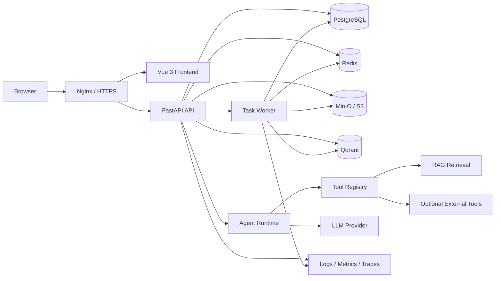
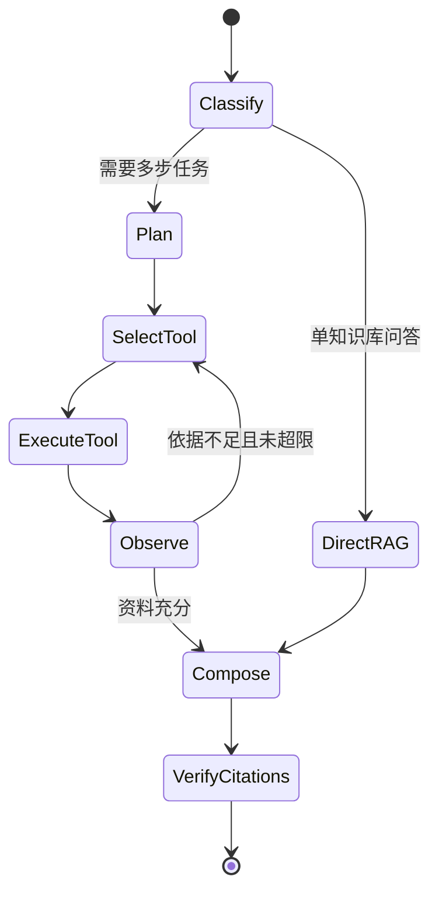

# KnowFlow 工程化推进计划书

## 1. 项目定位

KnowFlow 当前已经完成课程学习场景下的 RAG MVP，具备知识库管理、多格式文档解析、文本分块、向量检索、通义千问问答、引用溯源、历史会话和基础系统设置等能力。

下一阶段的目标不是简单增加页面和接口，而是将项目升级为一个：

- 可通过 Docker Compose 部署到任意 Linux 服务器；
- 支持多用户、多知识库和权限隔离；
- 文档处理异步、可重试、可观察；
- 检索质量可评测、回答来源可追踪；
- 支持受控工具调用和多步执行的知识库 Agent；
- 可测试、可升级、可备份和可恢复的工程化应用。

本文中的“Agent”指面向知识库任务的 AI Agent，而不是安装在目标服务器上的运维代理。首个生产版本采用受控工作流，不允许模型无限自主循环，也不默认开放具有副作用的工具。

## 2. 建设目标

### 2.1 最终交付目标

完成 `KnowFlow 1.0`，用户在一台新服务器上仅需准备 Docker、Docker Compose 和模型 API Key，即可通过以下流程启动系统：

```bash
git clone <repository>
cd KnowFlow
cp .env.example .env
docker compose up -d
```

部署完成后应具备：

1. Web 端用户登录和工作空间管理；
2. 知识库、文档和会话的完整管理功能；
3. 文档异步解析、分块、向量化、重建索引和失败重试；
4. 普通 RAG 问答与流式回答；
5. 混合检索、重排、阈值拒答和引用溯源；
6. Agent 模式下的工具选择、多步执行和执行轨迹；
7. 模型、Embedding、检索和分块参数配置；
8. 用户权限、审计日志、限流和敏感配置保护；
9. 健康检查、日志、指标、错误追踪、备份和恢复；
10. 自动测试、数据库迁移和持续集成。

### 2.2 非目标

首个生产版本暂不追求以下能力：

- Kubernetes 多集群部署；
- 自研向量数据库或自研 Agent 框架；
- 任意代码执行和无人审批的外部写操作；
- 大规模 OCR、音视频解析和模型训练平台；
- 面向百万并发的分布式架构。

先完成稳定的单机生产部署，同时保留横向扩展边界。

## 3. 当前状态与主要缺口

| 领域 | 当前实现 | 工程化缺口 |
| --- | --- | --- |
| API | FastAPI，同步接口 | 缺少统一错误码、API 版本、请求追踪、限流 |
| 元数据 | SQLite | 不适合多实例并发，缺少 Alembic 迁移 |
| 向量库 | 本地持久化 Chroma | 部署耦合本机目录，备份、并发和独立扩容能力有限 |
| 文件 | 保存在后端本地目录 | 多实例无法共享，缺少对象存储和文件校验 |
| 文档入库 | 上传请求内同步解析和向量化 | 大文件会阻塞请求，失败后缺少任务重试和进度 |
| Embedding | 384 维本地 hashing embedding | 可验证流程，但语义检索质量不足 |
| 检索 | 单路向量 Top-K | 缺少关键词检索、重排、过滤和离线评测 |
| LLM | 单一通义千问兼容接口 | 缺少 Provider 抽象、超时、重试、熔断和成本预算 |
| 对话 | 保存问答及 token | 未真正利用多轮历史，缺少上下文压缩和流式输出 |
| 用户体系 | 无登录，数据全局共享 | 缺少用户、工作空间、RBAC 和资源隔离 |
| 前端 | API 地址固定为 `127.0.0.1` | 无运行时配置，不能直接部署到其他服务器 |
| 运维 | 本地手工启动 | 无容器、反向代理、健康检查、监控、备份和恢复 |
| 质量 | 无项目测试 | 缺少单元、集成、端到端测试和 RAG 评测集 |
| 安全 | CORS 全开放 | 缺少来源限制、上传限制、密钥管理和审计 |

## 4. 目标架构

首个生产版本采用单机 Docker Compose 部署，并保持服务可拆分。



### 4.1 推荐技术选型

| 能力 | 选型 | 原因 |
| --- | --- | --- |
| 前端 | Vue 3 + Vite + Element Plus | 延续现有技术栈，降低迁移成本 |
| API | FastAPI + Pydantic Settings | 延续现有代码并强化配置管理 |
| ORM/迁移 | SQLAlchemy 2 + Alembic | 支持结构化迁移和回滚 |
| 元数据库 | PostgreSQL 16 | 支持并发、事务、JSON 和成熟备份方案 |
| 向量库 | Qdrant | 过滤、持久化、备份和服务化部署更适合生产 |
| 对象存储 | MinIO，兼容外部 S3 | 解决多实例文件共享和服务器迁移 |
| 缓存/队列 | Redis | 用于任务队列、限流、短期缓存和事件状态 |
| 异步任务 | Celery | 生态成熟，支持重试、超时和任务状态 |
| Agent 编排 | LangGraph | 使用状态图限制步骤和工具，更容易恢复与追踪 |
| 检索 | Dense + PostgreSQL FTS + Reranker | 兼顾语义召回、关键词召回和最终排序 |
| 可观察性 | structlog + Prometheus + OpenTelemetry | 统一日志、指标和链路追踪 |
| 网关 | Nginx | 提供静态资源、反向代理、上传限制和 TLS |
| 部署 | Docker Compose | 满足任意单台 Linux 服务器的可复制部署 |

说明：如果希望减少初期服务数量，可以先用 PostgreSQL + pgvector 替代 Qdrant。考虑到后续要做独立检索服务、payload 过滤和快照，计划书默认选择 Qdrant。

### 4.2 部署形态

提供三套配置，但只维护一套镜像：

- `dev`：本地热更新，可使用本地文件和较少依赖；
- `single-node`：一台服务器运行 Nginx、API、Worker、PostgreSQL、Redis、Qdrant、MinIO；
- `external-services`：数据库、Redis、对象存储和模型服务使用云产品，API 与 Worker 可横向扩展。

## 5. 完整功能范围

### 5.1 用户与权限

- 用户注册、登录、退出、刷新 Token、修改密码；
- 工作空间创建、成员邀请和成员移除；
- `owner/admin/editor/viewer` 四级角色；
- 知识库、文档、会话、系统配置按工作空间隔离；
- 管理员可查看任务状态、资源用量和审计日志；
- 所有数据库查询和向量检索必须携带 `workspace_id` 过滤条件。

### 5.2 知识库管理

- 创建、编辑、归档、删除知识库；
- 设置 Embedding 模型、分块策略、检索策略和默认 Prompt；
- 知识库统计：文档数、分块数、存储量、最近更新时间；
- 导入、导出、重建索引和删除索引；
- 支持标签和文档级 metadata 过滤。

### 5.3 文档处理

- 支持当前 `.txt`、`.md`、`.pdf`、`.docx`、`.pptx`；
- 增加 HTML、网页 URL 和批量 ZIP 导入；
- 文件大小、扩展名、MIME、哈希和重复文件校验；
- 文件上传后立即返回 `job_id`，后台完成解析和入库；
- 显示 `queued/parsing/chunking/embedding/indexing/finished/failed` 状态；
- 支持任务取消、失败重试、重新解析和重新向量化；
- 保存文档版本、解析器版本、Embedding 版本和索引版本；
- 扫描版 PDF 在后续版本接入 OCR，不阻塞 1.0 发布。

### 5.4 检索与 RAG

- Dense 向量检索；
- PostgreSQL 全文关键词检索；
- 两路结果通过 RRF 融合；
- Cross-Encoder 或 API Reranker 重排；
- 按知识库、文档、标签、时间和权限过滤；
- 支持 Top-K、score threshold、候选数和重排数配置；
- 无可靠依据时拒答；
- 引用信息包含文档名、页码或幻灯片、chunk、分数和片段；
- 支持 SSE 流式回答、中断生成和重新生成；
- 保存检索 trace、模型调用、Prompt 版本、耗时和 token 成本；
- 多轮会话采用最近消息 + 历史摘要，避免上下文无限增长。

### 5.5 Agent 能力

Agent 不是替换 RAG，而是在 RAG 之上增加受控编排。

第一版工具集：

| 工具 | 作用 | 是否有副作用 |
| --- | --- | --- |
| `search_knowledge_base` | 混合检索指定知识库 | 否 |
| `get_document_context` | 按引用位置读取相邻片段 | 否 |
| `list_knowledge_bases` | 查看用户可访问知识库 | 否 |
| `list_documents` | 按条件查询文档 | 否 |
| `compare_sources` | 对多个来源做结构化对比 | 否 |
| `calculator` | 处理确定性计算 | 否 |
| `web_search` | 可选外部检索，默认关闭 | 否 |
| `create_note` | 将回答保存为学习笔记 | 是，需要用户确认 |

Agent 执行状态：



Agent 必须具备以下保护：

- 最大步骤数，默认 6；
- 单步与总任务超时；
- 最大 token 和调用成本预算；
- 工具参数使用 Pydantic/JSON Schema 校验；
- 工具白名单和角色权限检查；
- 有副作用工具执行前要求用户确认；
- 每一步记录输入、输出、耗时和错误；
- 工具失败后有限次数重试，不允许无限循环；
- 最终回答执行引用一致性检查。

### 5.6 管理与运维

- 系统配置分为环境级配置和工作空间级配置；
- 模型 Provider 支持 OpenAI 兼容接口，首期接入 DashScope；
- API Key 只从环境变量或密钥服务读取，不保存明文到普通业务表；
- 系统状态展示 API、数据库、Redis、Qdrant、对象存储和模型服务健康情况；
- 查看任务队列、失败任务、模型调用量、token 和估算费用；
- 支持审计日志查询和导出；
- 提供备份、恢复、数据导出和版本升级文档。

## 6. 核心数据模型

在现有模型上增加或调整以下实体：

| 实体 | 关键字段 |
| --- | --- |
| `User` | id, email, password_hash, status, created_at |
| `Workspace` | id, name, owner_id, plan, created_at |
| `Membership` | workspace_id, user_id, role |
| `KnowledgeBase` | workspace_id, name, config_json, status |
| `Document` | workspace_id, kb_id, object_key, sha256, version, status |
| `DocumentChunk` | document_id, index, content, page_no, metadata_json, embedding_version |
| `IngestionJob` | document_id, stage, progress, retry_count, error_code, timestamps |
| `Conversation` | workspace_id, kb_scope_json, mode, title |
| `ChatMessage` | conversation_id, role, content, trace_id, usage_json |
| `Citation` | message_id, document_id, chunk_id, quote, score |
| `AgentRun` | conversation_id, status, step_count, budget, trace_json |
| `ProviderConfig` | workspace_id, provider, model, non_secret_config_json |
| `AuditLog` | actor_id, action, resource_type, resource_id, details_json |
| `EvaluationCase` | question, expected_sources, reference_answer, tags |
| `EvaluationRun` | version, metrics_json, status, created_at |

数据库结构通过 Alembic 管理，禁止在生产启动时调用 `Base.metadata.create_all()` 自动改表。

## 7. 后端模块划分

建议逐步整理为以下结构：

```text
backend/app/
|-- api/v1/                 # API 路由
|-- core/                   # 配置、安全、日志、异常、可观察性
|-- models/                 # SQLAlchemy 实体
|-- schemas/                # API 输入输出模型
|-- repositories/           # 数据访问层
|-- services/               # 业务服务
|-- providers/              # LLM、Embedding、Reranker、对象存储适配器
|-- retrieval/              # dense、keyword、fusion、rerank
|-- agents/                 # Agent 状态、节点、工具和策略
|-- tasks/                  # Celery 文档入库和维护任务
|-- migrations/             # Alembic
|-- observability/          # metrics、tracing、logging
`-- tests/                  # unit、integration、e2e
```

不要一次性重写全部代码。先建立接口边界，再将当前服务逐个迁入新目录。

## 8. 分阶段实施计划

以下工期按一名开发者全职投入估算，总周期约 7 至 9 周；若作为课程外项目兼职推进，可按每周一个里程碑执行。

### 阶段 0：冻结基线与修复基础问题，2 至 3 天

任务：

- 统一项目 UTF-8 编码，修复当前 README、Prompt 和界面中文乱码；
- 统一依赖来源，解决根目录 `pyproject.toml` 与 `backend/requirements.txt` 版本不一致；
- 固定 Python 和 Node 版本，补充 `.python-version`、`.nvmrc` 或容器版本；
- 将前端 API 地址改为 `VITE_API_BASE_URL`；
- 建立后端 `pytest` 和前端基础测试目录；
- 为现有知识库、上传、检索和问答流程增加冒烟测试；
- 记录当前 API 契约和示例数据，作为重构回归基线。

验收：

- 前后端均能通过构建；
- 现有核心流程自动化冒烟测试通过；
- 新环境不修改源码即可配置 API 地址和模型参数；
- 仓库不再出现中文乱码。

### 阶段 1：可移植部署基座，4 至 5 天

任务：

- 为前端、API 和 Worker 编写多阶段 Dockerfile；
- 增加 `compose.yaml`、`.env.example` 和服务 healthcheck；
- 增加 Nginx，统一通过 `/api` 访问后端；
- 引入 PostgreSQL、Redis、Qdrant、MinIO；
- 使用 Pydantic Settings 管理配置并在启动时校验必填项；
- 接入 Alembic，创建首个数据库版本；
- 编写 `scripts/bootstrap.ps1`、`scripts/bootstrap.sh` 和部署文档；
- 增加持久化 volume、日志轮转和容器重启策略。

验收：

- 在一台干净 Linux 服务器上能够 `docker compose up -d` 启动；
- `/health/live` 与 `/health/ready` 能正确反映依赖状态；
- 重启容器后数据库、向量、文件和会话数据不丢失；
- 浏览器只访问服务器域名，不依赖 `127.0.0.1:8000`。

### 阶段 2：数据层和文档异步入库，5 至 7 天

任务：

- 将 SQLite 数据模型迁移到 PostgreSQL；
- 将本地文件迁移到 MinIO/S3 适配器；
- 将 Chroma 操作迁移到 Qdrant Provider；
- 接入 Celery Worker，上传接口只创建文档和任务；
- 将解析、分块、Embedding、索引拆成可重试阶段；
- 增加任务进度、错误码、重试、取消和重新入库接口；
- 增加 SHA-256 去重、MIME 检查、文件大小限制；
- 删除文档时通过补偿任务清理数据库、对象和向量数据；
- 增加并发上传和失败恢复集成测试。

验收：

- 上传接口在保存文件后快速返回，不等待 Embedding 完成；
- Worker 异常重启后任务可恢复或安全重试；
- 同一任务重复执行不会生成重复 chunk；
- 文档删除后不存在孤立文件和向量；
- 50 个文档批量导入时 API 仍可正常提供查询服务。

### 阶段 3：生产级 RAG，5 至 7 天

任务：

- 抽象 `EmbeddingProvider`，接入 BGE-M3 或 DashScope Embedding；
- 重新设计 chunk metadata，保留页码、标题层级、幻灯片和表格来源；
- 实现 Dense + PostgreSQL FTS 混合召回；
- 使用 RRF 融合并接入可配置 Reranker；
- 实现检索过滤、阈值拒答和引用一致性检查；
- 抽象 `LLMProvider`，加入超时、指数退避、错误映射和并发限制；
- 增加 SSE 流式回答和客户端取消；
- 将对话历史摘要加入 Prompt；
- 持久化检索 trace、Provider、模型、Prompt 版本、耗时和费用。

验收：

- 使用至少 50 个课程问题建立评测集；
- `Recall@5 >= 0.80`；
- 引用正确率 `>= 0.90`；
- 有依据回答的 groundedness `>= 0.85`；
- 无依据问题能够按阈值拒答；
- LLM 故障不会造成 API 进程崩溃，并返回可识别错误码。

### 阶段 4：用户、权限与安全，5 至 6 天

任务：

- 增加用户、工作空间和 Membership 数据模型；
- 实现密码哈希、JWT Access Token、Refresh Token 和退出登录；
- 实现 RBAC 依赖和所有资源的 workspace 隔离；
- 对向量检索增加 workspace 与 kb 双重过滤；
- 收紧 CORS，增加上传、登录和问答接口限流；
- 对关键操作写入审计日志；
- 隐藏日志和响应中的密钥、Prompt 敏感字段；
- 增加越权、路径穿越、伪造 MIME 和超大文件测试。

验收：

- 用户无法读取、搜索或删除其他工作空间资源；
- viewer 无法执行写操作；
- 所有管理操作均可追溯到用户和请求 ID；
- API Key 不出现在前端、数据库明文、日志和错误响应中。

### 阶段 5：知识库 Agent，5 至 7 天

任务：

- 使用 LangGraph 定义 Agent State 和有限状态图；
- 建立 Tool Registry 和统一工具输入输出协议；
- 实现知识库检索、上下文扩展、文档列表、来源对比和计算器工具；
- 增加任务分类：直接问答、多知识库研究、文档对比、总结提炼；
- 增加步骤上限、超时、成本预算、权限检查和工具错误恢复；
- 保存 AgentRun、每步工具调用、结果摘要和最终引用；
- 前端展示执行状态和可折叠轨迹；
- 对创建笔记等写工具增加人工确认节点；
- 建立 Agent 场景测试，避免循环、误用工具和越权。

验收：

- 单知识库问题仍走短路径，不强制进入多步 Agent；
- 跨文档比较任务能够调用至少两次检索并生成带引用结论；
- 任意任务均在步骤、时间和预算上限内结束；
- 写操作未经用户确认不得执行；
- Agent 工具无法绕过 workspace 权限。

### 阶段 6：前端产品化，4 至 6 天

任务：

- 增加登录、工作空间切换和成员管理；
- 增加异步上传队列、阶段进度、失败详情和重试；
- 增加流式问答、中断、重新生成、复制和反馈；
- 增加普通 RAG/Agent 模式切换；
- 增加来源定位、文档预览和 Agent 轨迹；
- 增加知识库配置、模型配置、用量和任务管理页面；
- 处理空状态、错误状态、权限状态和移动端基本布局；
- 使用环境配置或同源 `/api`，移除本机地址依赖。

验收：

- 用户可在 Web 端完成全部主要流程；
- 页面刷新后会话、任务和选中工作空间可恢复；
- 常见错误均有明确处理入口，不只弹出通用错误；
- Playwright 覆盖登录、上传、入库、问答、引用和删除主流程。

### 阶段 7：质量、可观察性与发布，5 至 7 天

任务：

- 为 parser、chunker、retrieval、权限和 Agent 节点补齐单元测试；
- 使用真实 PostgreSQL、Redis、Qdrant 和 MinIO 跑集成测试；
- 建立 RAG/Agent 离线评测命令和版本对比报告；
- 输出 JSON 结构化日志，贯穿 `request_id/trace_id/user_id/job_id`；
- 暴露 Prometheus 指标，接入 Grafana 基础面板；
- 接入 OpenTelemetry，至少追踪 API、任务、检索和 LLM 调用；
- 增加 GitHub Actions：lint、test、build、镜像安全扫描；
- 发布版本化镜像，编写升级、回滚、备份和恢复手册；
- 完成一次新服务器部署演练和一次备份恢复演练。

验收：

- 核心业务代码覆盖率 `>= 75%`；
- PR 必须通过测试、前端构建和镜像构建；
- 非 LLM 普通 API 的 `p95 < 500ms`；
- 任务失败率、LLM 错误率和请求延迟可在监控面板查看；
- 能从备份恢复 PostgreSQL、Qdrant 和对象存储，并通过抽样问答验证。

## 9. API 规划

统一使用 `/api/v1`，旧接口在迁移期保留兼容层。

```text
POST   /api/v1/auth/login
POST   /api/v1/auth/refresh
GET    /api/v1/workspaces
POST   /api/v1/workspaces
GET    /api/v1/knowledge-bases
POST   /api/v1/knowledge-bases
PATCH  /api/v1/knowledge-bases/{id}
DELETE /api/v1/knowledge-bases/{id}
POST   /api/v1/knowledge-bases/{id}/documents
GET    /api/v1/documents/{id}
POST   /api/v1/documents/{id}/reindex
GET    /api/v1/jobs/{id}
POST   /api/v1/jobs/{id}/retry
POST   /api/v1/retrieval/search
POST   /api/v1/chat/completions
GET    /api/v1/chat/completions/{id}/events
POST   /api/v1/agent/runs
GET    /api/v1/agent/runs/{id}
POST   /api/v1/agent/runs/{id}/confirm
GET    /api/v1/admin/metrics/summary
GET    /api/v1/admin/audit-logs
```

所有响应包含：

```json
{
  "data": {},
  "request_id": "...",
  "error": null
}
```

错误响应使用稳定的业务错误码，例如 `DOCUMENT_PARSE_FAILED`、`PROVIDER_TIMEOUT`、`PERMISSION_DENIED`，前端不依赖英文异常文本判断状态。

## 10. 测试和评测策略

### 10.1 工程测试

- 单元测试：解析器、分块器、Provider、融合算法、权限规则、Agent 节点；
- 集成测试：数据库迁移、对象存储、队列、Qdrant、完整入库；
- API 契约测试：状态码、错误码、分页和权限；
- E2E：登录、创建知识库、上传、等待入库、提问、查看引用、删除；
- 故障测试：模型超时、Worker 重启、Redis 短暂不可用、重复任务；
- 安全测试：越权、路径穿越、恶意文件名、超限上传、暴力登录。

### 10.2 RAG 评测

在 `evals/datasets/` 保存版本化数据集，每条包含：

- 问题；
- 预期命中文档或 chunk；
- 参考答案；
- 是否应该拒答；
- 题型和难度标签。

每次调整 Embedding、chunk、Top-K、reranker 或 Prompt 后输出：

- Recall@K、MRR、nDCG；
- 引用正确率；
- groundedness；
- answer relevance；
- 拒答准确率；
- 平均延迟、token 和估算成本。

没有评测集之前，不应凭少量手工问题宣布“检索效果提升”。

## 11. 安全基线

- 生产环境必须启用 HTTPS；
- 密码使用 Argon2 或 bcrypt；
- Access Token 短期有效，Refresh Token 可撤销；
- CORS 只允许配置域名；
- 文件名不直接用于存储路径；
- 上传设置大小、MIME、扩展名和解压上限；
- 解析任务运行在 Worker，设置 CPU、内存和时间限制；
- 对 Prompt Injection 将外部文档视为不可信数据，工具调用必须由权限层再次校验；
- 管理 API、模型配置和写工具要求更高角色；
- 日志脱敏，不记录 Authorization、Cookie 和完整密钥；
- 镜像使用非 root 用户并定期扫描依赖漏洞。

## 12. 备份、恢复与升级

备份对象：

- PostgreSQL：每日 `pg_dump`，保留 7 至 30 天；
- Qdrant：每日 snapshot；
- MinIO/S3：版本控制或增量同步；
- 配置：保存不含密钥的版本化配置；
- 密钥：由服务器环境或密钥管理系统独立保存。

恢复顺序：PostgreSQL -> 对象存储 -> Qdrant。如果向量快照不可用，应支持从 PostgreSQL 中的 chunk 和对象文件重新构建索引。

每次发布必须：

1. 备份数据库；
2. 执行 Alembic migration；
3. 发布带版本号镜像；
4. 运行 smoke test；
5. 保留上一版本镜像和回滚说明。

## 13. 服务器资源建议

使用云端 LLM 和 Embedding API 时：

| 场景 | CPU | 内存 | 磁盘 |
| --- | --- | --- | --- |
| 个人演示/课程答辩 | 2 核 | 4 GB | 40 GB SSD |
| 小团队生产 | 4 核 | 8 GB | 100 GB SSD |
| 文档量较大或并发处理 | 8 核 | 16 GB | 200 GB+ SSD |

如果在服务器本地运行 BGE-M3/Reranker，需要根据模型增加 GPU 或单独部署模型服务，不建议与首个生产版本强绑定。

## 14. 发布验收标准

`KnowFlow 1.0` 只有同时满足以下条件才视为完成：

- 新 Linux 服务器 20 分钟内完成部署；
- 所有容器通过 readiness 检查；
- 用户、工作空间和权限隔离测试通过；
- 支持多格式文档异步入库、进度查看、失败重试和重建索引；
- 普通 RAG 和 Agent 两种模式均可使用；
- 回答提供可定位到文档位置的引用；
- RAG 评测达到既定检索、引用和 groundedness 指标；
- 核心 E2E 流程通过；
- 日志、指标和错误追踪可用；
- 备份恢复演练成功；
- 部署、配置、升级、回滚和故障排查文档完整。

## 15. 第一迭代任务清单

第一迭代只做“工程基线 + 可部署骨架”，建议直接拆为以下 Issue：

1. 修复仓库中文编码并增加编码检查；
2. 统一 Python 依赖和运行版本；
3. 将后端配置迁移到 Pydantic Settings；
4. 将前端 API 地址改为环境变量和同源 `/api`；
5. 增加 API `/health/live` 与 `/health/ready`；
6. 引入 pytest，覆盖 health、知识库 CRUD 和分块器；
7. 增加前端生产构建检查；
8. 编写前端和后端 Dockerfile；
9. 编写 Nginx 配置和 `compose.yaml`；
10. 引入 PostgreSQL 和 Alembic，生成首个 migration；
11. 增加 GitHub Actions 执行 lint、test、build；
12. 编写 Linux 服务器部署和故障排查文档。

本迭代完成后再迁移 Qdrant、MinIO 和异步任务。这样每一步都有可运行版本，出现问题时容易定位和回退。

## 16. 推荐执行顺序

工程化优先级应保持如下顺序：

```text
编码与测试基线
-> 可配置和容器化
-> PostgreSQL/迁移
-> 对象存储/向量服务/异步任务
-> 检索质量与评测
-> 用户权限和安全
-> Agent 编排
-> 可观察性、备份与正式发布
```

关键原则是：Agent 是上层能力，数据可靠性、检索质量和权限隔离是它的地基。先完成可部署 RAG，再增加 Agent，可以保证每个阶段都有独立、可展示、可写进项目经历的成果。
