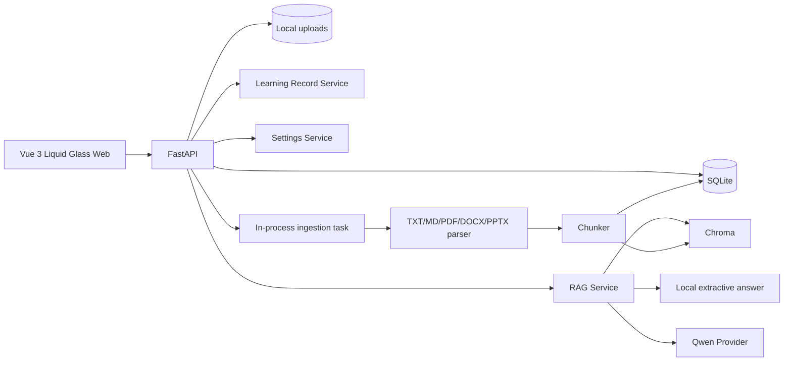

# KnowFlow 技术方案

## 1. 目标与工程判断

本方案服务于一个本地单用户 V1：让“课程资料 -> 可信回答 -> 学习沉淀”完整可运行。

从第一性原理出发，系统只有三类不可替代的数据：

- **事实数据**：课程、文档、分块、会话、消息、笔记、练习、错题和设置；
- **可重建数据**：Embedding 与 Chroma 向量索引；
- **外部能力**：LLM/Embedding Provider，可用性不能决定本地事实数据是否可用。

因此 SQLite 是事实源，上传文件是原始资产，Chroma 是可重建缓存；云端模型不可用时，系统退化为本地抽取式回答，而不是让整个学习流程报错。

## 2. V1 架构



部署边界：

- 默认仅监听 `127.0.0.1`；
- SQLite、上传目录与 Chroma 均在本机；
- FastAPI BackgroundTasks 只用于本地单实例；
- 公网或多用户部署前必须增加认证、租户隔离、限流、持久任务和迁移系统。

## 3. 模块职责

```text
backend/app/
|-- api/           HTTP 协议、校验、错误映射
|-- models/        SQLite 事实模型
|-- schemas/       稳定输入输出契约
|-- services/      入库、检索、回答、学习记录、设置与导出
|-- core/          配置、数据库、启动兼容检查
frontend/src/demo/
|-- views/         学习助手壳、知识库、学习记录、设置
|-- api/           API 调用与错误归一化
|-- composables/   跨视图的课程/会话/资料状态
|-- utils/         纯函数与格式化逻辑
|-- *.css          视觉与响应式规则
```

API 不直接拼复杂业务；Provider 不持有课程和学习记录状态。

## 4. 数据模型

保留现有 `KnowledgeBase`、`Document`、`DocumentChunk`、`Conversation`、`ChatMessage`、`SystemSetting`，增加：

### 4.1 LearningRecord

| 字段 | 说明 |
| --- | --- |
| id | 主键 |
| kb_id | 所属课程 |
| conversation_id | 可选来源会话 |
| source_message_id | 可选来源回答 |
| record_type | note / exercise / mistake |
| title | 学习记录标题 |
| content | Markdown 正文 |
| tags_json | 标签 |
| metadata_json | 题目、作答、复习状态等扩展信息 |
| created_at / updated_at | 时间 |

会话不复制为 LearningRecord，学习记录接口在查询时统一聚合会话和 LearningRecord。

### 4.2 引用 DTO

不新增重复 Citation 表。V1 在 ChatMessage 的 `sources_json` 中持久化快照，并在回答前用 SQLite 补齐：

```json
{
  "chunk_id": 12,
  "document_id": 4,
  "document_title": "Spark 编程指南",
  "location": "第 3 个片段",
  "content": "...",
  "score": 0.91
}
```

这样历史回答不会因文档重新分块而改变展示；更精细页码/章节将在结构化解析阶段升级。

## 5. 文档入库

### 5.1 流程

```text
扩展名/大小/空文件校验
-> 随机文件名落盘
-> 创建 processing 文档
-> 后台解析
-> 分块并写 SQLite
-> 向量批量 upsert
-> 标记 finished
失败 -> 回滚分块/补偿向量 -> 标记 failed + error_message
```

要求：

- 支持 `.txt/.md/.pdf/.docx/.pptx`；
- 原始文件名只作为元数据，存储名随机；
- 前端上传进度与服务端处理状态分开显示；
- 重试前清理旧分块和向量；
- 删除先提交事实数据，再尽力清理文件和向量；
- 应用启动时把异常遗留的 `processing` 文档标记为可重试失败态。

## 6. 检索与回答

### 6.1 检索

V1 使用当前向量召回，并保留检索轨迹：

```text
当前问题 + 最近用户问题
-> 当前课程过滤
-> Top K 向量召回
-> 阈值判断
-> 引用元数据补齐
```

阈值未通过时直接返回“知识库中未找到足够依据”，不调用 LLM。

### 6.2 Provider 与隐私模式

- `local`：本地 hashing embedding + 本地抽取式回答，不外发；
- `hybrid`：本地资料/索引，只有命中片段和问题发送给云端 LLM；无 Key 自动本地降级；
- `cloud`：允许配置的云端 LLM/Embedding；Provider 不可用时返回稳定错误或本地降级标识。

回答响应增加：

- `answer_mode`: local / cloud；
- `provider`: 实际使用的 Provider；
- `insufficient_evidence`: 是否拒答；
- `sources`: 已补齐的引用；
- `retrieval_trace`: Top K、阈值、最高分和命中。

### 6.3 学习任务

`ChatRequest.mode` 支持：

- question；
- explain；
- compare；
- summarize；
- exercise。

云端模式通过不同系统约束生成；本地模式使用确定性模板，把命中资料组织为解释/对比/总结/练习草稿。所有模式共享同一证据门槛。

## 7. API 契约

沿用现有 `/api`，避免无收益的版本迁移：

| 方法 | 路径 | 作用 |
| --- | --- | --- |
| GET/POST | `/api/kbs` | 课程列表/创建 |
| GET/PATCH/DELETE | `/api/kbs/{id}` | 课程详情/编辑/删除 |
| POST | `/api/kbs/{id}/documents/upload` | 上传资料 |
| GET | `/api/kbs/{id}/documents` | 资料列表 |
| GET/DELETE | `/api/documents/{id}` | 资料详情/删除 |
| GET | `/api/documents/{id}/chunks` | 原文分块 |
| POST | `/api/documents/{id}/retry` | 失败重试 |
| POST | `/api/kbs/{id}/rebuild-index` | 重建索引 |
| POST | `/api/chat` | 资料约束问答/学习任务 |
| GET/POST/DELETE | `/api/conversations` | 会话列表/创建/删除 |
| GET | `/api/conversations/{id}` | 会话与引用详情 |
| GET/POST | `/api/learning-records` | 学习记录列表/创建 |
| GET/PATCH/DELETE | `/api/learning-records/{id}` | 学习记录详情/更新/删除 |
| GET/PATCH | `/api/admin/settings` | 检索、模型和隐私设置 |
| GET | `/api/admin/providers` | 实际 Provider/索引状态 |
| GET | `/api/admin/export` | 导出用户事实数据 |
| DELETE | `/api/admin/data` | 确认后清理事实数据与索引 |
| GET | `/api/admin/status` | 系统统计 |

错误响应继续使用 FastAPI `detail`，前端统一映射为用户可执行的提示。

## 8. 前端实现

正式入口切换为已确认的 Liquid Glass 工作台，Demo 与正式入口复用同一应用组件。

### 8.1 状态

根级 composable 管理：

- 当前课程；
- 课程列表与统计；
- 当前会话与消息；
- 资料轮询；
- 系统设置与 Provider 状态。

视图只管理筛选、面板开关和表单草稿。

### 8.2 页面

- **学习助手**：真实消息流、五种任务模式、来源面板、保存笔记/练习、新会话；
- **课程知识库**：真实 CRUD、上传、状态轮询、重试、删除、分块预览；
- **学习记录**：聚合会话与 note/exercise/mistake，筛选、详情、继续与删除；
- **设置**：真实读取/保存参数、Provider 状态、导出与确认清理。

### 8.3 体验要求

- API 加载、空、错误、禁用状态完整；
- 文档处理轮询使用递增退避并在离开页面/卸载时停止；
- 移动端无页面级横向溢出，触控目标至少 44px；
- 证据面板桌面折叠为竖向胶囊，移动端为横向胶囊；
- 不在浏览器保存 API Key。

## 9. 测试策略

### 9.1 后端

- 模型与 schema 单元测试；
- 课程/文档/会话/学习记录/settings API 集成测试；
- 无 API Key 的本地回答、拒答阈值和引用补齐测试；
- 数据导出/清理、失败重试和遗留 processing 恢复测试；
- Ruff、编译与依赖检查。

### 9.2 前端

- API client 与状态纯函数单元测试；
- 文档状态、学习记录聚合、错误映射测试；
- 浏览器验收：创建课程、上传、问答、保存、恢复会话、设置、导出；
- 390px、768px、1440px 视口与控制台检查；
- `npm test` 和 `npm run build` 必须通过。

## 10. 交付阶段与提交边界

1. **文档合同**：更新产品与技术方案，增加契约测试；
2. **后端闭环**：学习记录、本地回答、引用补齐、隐私设置、导出/清理；
3. **前端接入**：Liquid Glass 正式入口连接真实 API；
4. **端到端验收**：修复集成问题、更新说明与测试。

每阶段独立 Git commit，任何阶段测试失败不得进入下一阶段。

## 11. V1 验收

- 全新本地环境无需云端 Key 即可创建课程、上传文本资料并得到有引用的回答；
- 配置云端 Key 后能使用 Qwen，界面显示实际回答模式；
- 文档、会话、笔记、练习和错题持久化并可删除；
- 设置刷新后保留，导出结果包含全部事实数据；
- 应用重启后遗留处理任务可恢复为可重试状态；
- 后端与前端全部测试、静态检查和构建通过；
- 桌面、平板、手机完成核心路径且无控制台错误。
