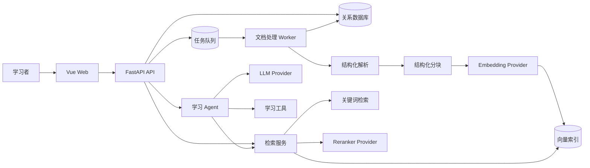
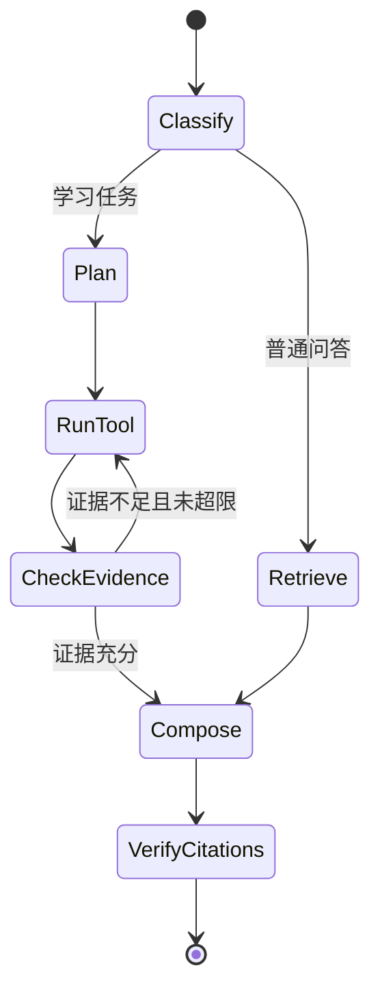

# KnowFlow 技术方案

## 1. 方案目标

本方案用于将 KnowFlow 从本地 RAG MVP 演进为面向大数据课程学习的私有知识库 Agent，重点解决以下问题：

- 文档解析缺少章节、页码和幻灯片等结构信息；
- 单路向量检索质量不稳定，低相关内容仍可能触发回答；
- SQLite、文件和向量索引之间存在一致性风险；
- 进程内后台任务无法可靠恢复；
- 模型降级和资料外发不透明；
- 当前问答流程无法支持总结、对比、练习等学习任务。

方案遵循三个原则：优先改善核心学习体验、保留本地部署能力、通过清晰接口支持后续扩展。

## 2. 总体架构

第一阶段继续采用单体 API + 独立任务 Worker，避免过早拆分微服务。各类外部能力通过 Provider 接口接入，使本地模型、云端模型和不同向量库可以替换。



### 2.1 部署形态

- **开发模式**：SQLite、Chroma、本地文件和轻量任务执行器；
- **本地正式模式**：PostgreSQL、Redis、Worker、Chroma 或 Qdrant；
- **云端增强模式**：保留本地数据层，只将用户明确授权的片段发送给云端模型。

早期仍可使用 SQLite 和 Chroma，但业务代码不得直接依赖具体实现，为后续迁移保留边界。

## 3. 模块划分

```text
backend/app/
|-- api/                 # HTTP 接口和参数校验
|-- core/                # 配置、认证、日志、异常、数据库
|-- models/              # 业务实体
|-- repositories/        # 数据访问与租户过滤
|-- ingestion/           # 上传、解析、分块、索引任务
|-- retrieval/           # 召回、融合、重排、阈值判断
|-- agents/              # Agent 状态、任务和工具编排
|-- providers/           # LLM、Embedding、Reranker、存储适配器
|-- services/            # 会话、引用、笔记、练习等业务逻辑
`-- workers/             # 可恢复后台任务

frontend/src/
|-- views/               # 学习助手、知识库、学习记录、设置
|-- components/          # 问答、引用、文档、任务等组件
|-- composables/         # 页面状态和业务流程
|-- api/                 # 按领域划分的 API client
`-- stores/              # 用户、知识库、会话等共享状态
```

API 层只负责协议转换和权限检查，核心逻辑放入服务层；Provider 只负责封装外部系统，不包含业务判断。

## 4. 文档入库方案

### 4.1 入库流程

```text
上传并校验文件
-> 创建 Document 和 IngestionJob
-> Worker 获取任务租约
-> 解析为结构化内容块
-> 按标题和语义边界分块
-> 批量生成向量
-> 写入版本化索引
-> 校验分块数和索引数
-> 切换有效索引版本
-> 标记任务完成
```

### 4.2 结构化解析

解析器统一返回 `ParsedBlock`，而不是直接返回一个大字符串：

```python
class ParsedBlock(BaseModel):
    text: str
    block_type: Literal["title", "paragraph", "table", "code", "list"]
    page_number: int | None = None
    slide_number: int | None = None
    heading_path: list[str] = Field(default_factory=list)
    order: int
```

分块时保留 `document_id`、标题路径、页码范围、内容类型、解析器版本和分块版本。引用可以据此定位到原文，而不再只显示 chunk 编号。

### 4.3 安全限制

- 同时校验扩展名、MIME、文件签名和文件哈希；
- 限制文件大小、PDF 页数、压缩文件展开大小和对象数量；
- 解析在独立 Worker 中执行，并设置时间、CPU 和内存限制；
- 上传文件使用随机存储名，原始文件名只作为元数据；
- 相同知识库中的重复文件通过 SHA-256 提示用户。

### 4.4 任务可靠性

`IngestionJob` 使用 `queued/running/succeeded/failed/cancelled` 状态，并记录当前阶段、进度、租约到期时间和重试次数。任务必须幂等，同一任务重复执行不能生成重复分块。

数据库保存事实数据，向量库保存可重建索引。使用 outbox 事件协调数据库与向量库写入；重建索引时先写新版本，验证成功后再切换，避免先删除旧索引导致服务中断。

## 5. 检索与 RAG 方案

### 5.1 检索流水线

```text
用户问题
-> 基于会话生成独立检索问题
-> 权限和资料范围过滤
-> Dense 语义召回 + BM25 关键词召回
-> RRF 融合和去重
-> Reranker 重排
-> 相关性阈值判断
-> 相邻片段扩展
-> 生成回答并校验引用
```

- Dense 检索负责概念和语义相似问题；
- BM25 负责命令、类名、配置项和专业术语的精确召回；
- Reranker 对候选片段进行最终排序；
- 阈值根据评测集校准，不使用未经验证的固定经验值；
- 相邻片段扩展用于补足定义前后的上下文，但不计入原始命中分数。

### 5.2 回答约束

LLM 输入由系统规则、会话摘要、用户问题和编号证据块组成。生成结果应使用结构化响应：

```json
{
  "answer": "... [1]",
  "claims": [
    {"text": "...", "citation_ids": [1]}
  ],
  "insufficient_evidence": false
}
```

服务端检查引用编号是否存在，并为每个引用补充文档名、章节、页码和片段。检索结果低于阈值时直接拒答，不调用生成模型。

### 5.3 多轮对话

多轮对话使用“最近消息 + 历史摘要 + 当前独立问题”，避免把全部历史无限加入上下文。独立问题只用于检索，最终回答仍保留用户的原始表达。

## 6. 学习 Agent 方案

Agent 采用有限状态工作流，不允许模型无限循环。第一版支持：概念讲解、知识点对比、章节总结、多文档综合、练习生成、答题批改和实验辅助。



首批只读工具包括：

- `search_knowledge_base`：检索指定课程资料；
- `get_neighbor_context`：读取命中片段的上下文；
- `compare_sources`：整理多个来源的共同点和差异；
- `get_course_outline`：读取课程章节结构；
- `calculator`：执行确定性计算。

每次执行限制最大步骤数、总超时、模型调用次数和 token 预算。写入笔记、删除资料等有副作用的工具必须经过用户确认，并再次进行权限校验。

## 7. 数据模型调整

在现有模型基础上增加以下核心实体或字段：

| 实体 | 关键内容 |
| --- | --- |
| `KnowledgeBase` | 所有者、处理模式、检索配置、有效索引版本 |
| `Document` | 文件哈希、存储位置、版本、解析器版本 |
| `DocumentChunk` | 标题路径、页码、内容类型、分块版本 |
| `IngestionJob` | 状态、阶段、进度、租约、重试和错误码 |
| `Citation` | 消息、文档、分块、原文位置和相关分数 |
| `Conversation` | 模式、资料范围和历史摘要 |
| `AgentRun` | 任务类型、状态、步骤、预算和执行轨迹 |
| `LearningNote` | 来源消息、课程、正文和标签 |
| `Exercise` | 题型、题目、答案、依据和作答记录 |
| `EvaluationCase` | 问题、预期来源、参考答案和拒答标记 |

数据库结构统一使用 Alembic 迁移，不再依赖应用启动时的 `create_all()` 更新已有数据库。

## 8. API 设计

新接口统一使用 `/api/v1`，主要资源如下：

```text
POST   /api/v1/knowledge-bases
GET    /api/v1/knowledge-bases/{id}
POST   /api/v1/knowledge-bases/{id}/documents
GET    /api/v1/documents/{id}
POST   /api/v1/documents/{id}/retry
POST   /api/v1/documents/{id}/reindex
GET    /api/v1/ingestion-jobs/{id}
POST   /api/v1/retrieval/search
POST   /api/v1/conversations/{id}/messages
GET    /api/v1/conversations/{id}/events
POST   /api/v1/agent-runs
GET    /api/v1/agent-runs/{id}
POST   /api/v1/agent-runs/{id}/confirm
POST   /api/v1/notes
POST   /api/v1/exercises
```

问答使用 SSE 返回状态、增量文本、引用和最终用量；客户端断开后停止不必要的模型调用。错误响应使用稳定错误码，例如 `DOCUMENT_PARSE_FAILED`、`INSUFFICIENT_EVIDENCE` 和 `PROVIDER_TIMEOUT`。

## 9. 隐私与安全

- 默认仅允许本机访问，公网部署前必须启用认证和 HTTPS；
- 所有知识库、文档、会话和向量查询都必须带所有者过滤；
- 完全本地模式不得调用任何云端 LLM、Embedding 或 Reranker；
- 云端增强模式首次启用时记录用户授权，并说明外发数据范围；
- API Key 仅从环境变量或密钥服务读取，不进入前端和业务数据库；
- 问答、上传和管理接口分别设置限流和资源配额；
- 文档内容始终视为不可信数据，不能直接改变 Agent 规则或工具权限；
- 日志记录请求 ID、任务 ID 和错误码，但不记录完整文档、密钥和 Authorization。

## 10. 前端改造

将当前单体 `App.vue` 拆为四个视图：学习助手、课程知识库、学习记录和设置。核心组件包括：

- 文档上传队列与分阶段进度；
- 对话消息流与停止生成；
- 声明级引用和原文定位面板；
- 普通问答/学习任务模式选择；
- Agent 执行轨迹；
- 模型状态和隐私模式提示；
- 笔记、练习和错题列表。

视图按路由懒加载，Element Plus 组件按需引入。服务端状态使用共享 store，临时输入留在页面组件，避免所有状态继续集中在根组件中。

## 11. 测试与评测

### 11.1 工程测试

- 单元测试：解析、分块、融合、阈值、引用校验和 Agent 节点；
- 集成测试：数据库、任务队列、向量索引和模型 Provider；
- API 测试：权限、分页、错误码、任务恢复和幂等性；
- E2E 测试：上传、入库、提问、查看引用、生成练习和删除数据；
- 安全测试：越权、伪造文件、压缩炸弹、Prompt Injection 和限流。

### 11.2 RAG 评测

建立版本化的大数据课程评测集，至少包含事实题、概念对比题、跨文档题、命令检索题和应拒答问题。每次变更 Embedding、分块、检索、Reranker 或 Prompt 后比较：

- Recall@K、MRR 和 nDCG；
- 引用正确率和回答忠实度；
- 拒答准确率；
- 平均响应时间、token 和成本。

核心检索与回答指标下降时，CI 阻止合并。

## 12. 实施顺序

### 阶段一：可信 RAG

1. 引入数据库迁移和 Provider 接口；
2. 改造结构化解析与分块元数据；
3. 建立持久任务和版本化索引；
4. 实现混合检索、重排、阈值拒答和引用校验；
5. 建立第一版课程评测集。

### 阶段二：学习工作流

1. 改造流式对话和多轮上下文；
2. 增加总结、对比、练习和批改工作流；
3. 增加笔记、练习和错题数据；
4. 拆分前端视图并完善状态反馈。

### 阶段三：长期运行能力

1. 增加用户认证、所有权校验和数据隔离；
2. 完成本地/云端隐私模式；
3. 增加限流、审计、监控、备份和恢复；
4. 根据实际规模迁移 PostgreSQL、Redis 和服务化向量库。

## 13. 验收标准

- 文档解析结果能够保留并展示章节、页码或幻灯片位置；
- 文档任务在进程重启后能够恢复，不产生重复分块和孤儿向量；
- 常见课程问题能够命中正确来源，依据不足的问题稳定拒答；
- 回答中的关键结论具有可打开、可定位的引用；
- 完全本地模式经过测试，确认不会产生模型服务外部请求；
- Agent 在步骤、时间和成本限制内完成学习任务；
- 用户能够完成上传、问答、引用回查和练习生成的端到端流程；
- 自动化测试、静态检查、前端构建和 RAG 评测全部通过。
