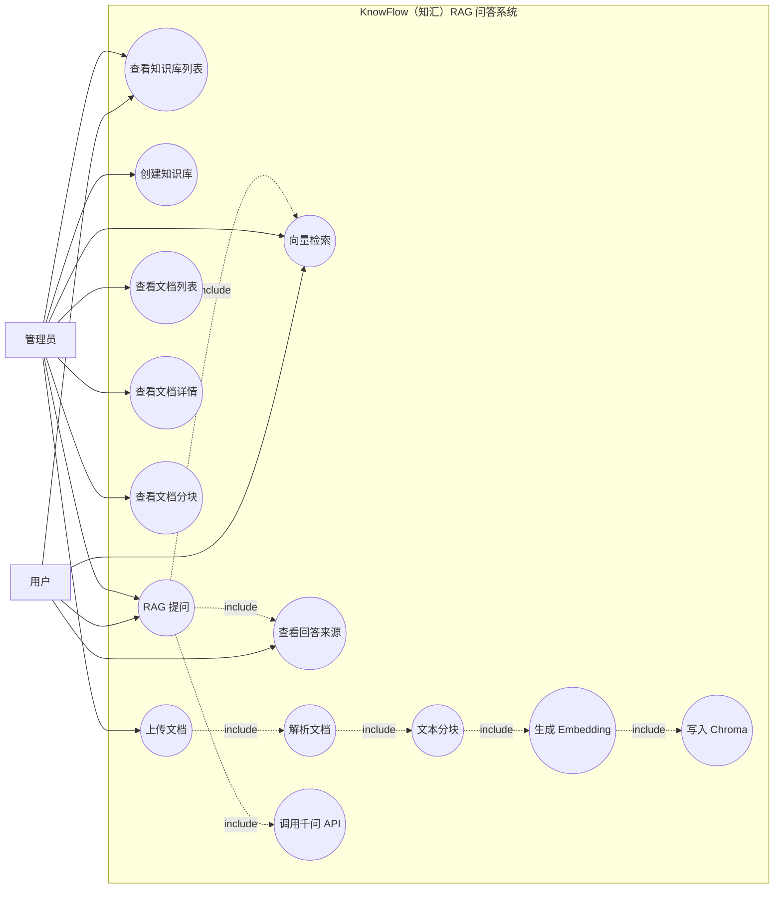
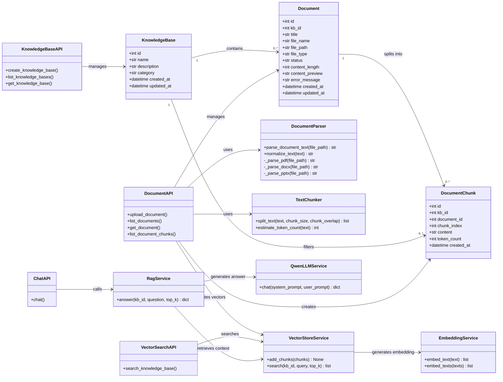
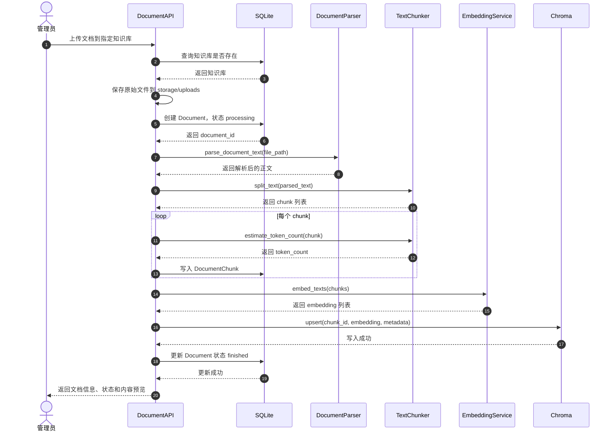
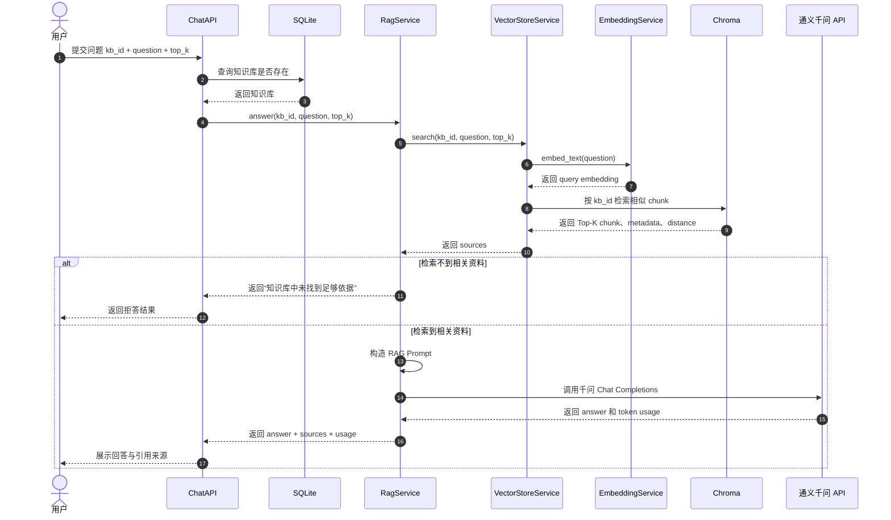
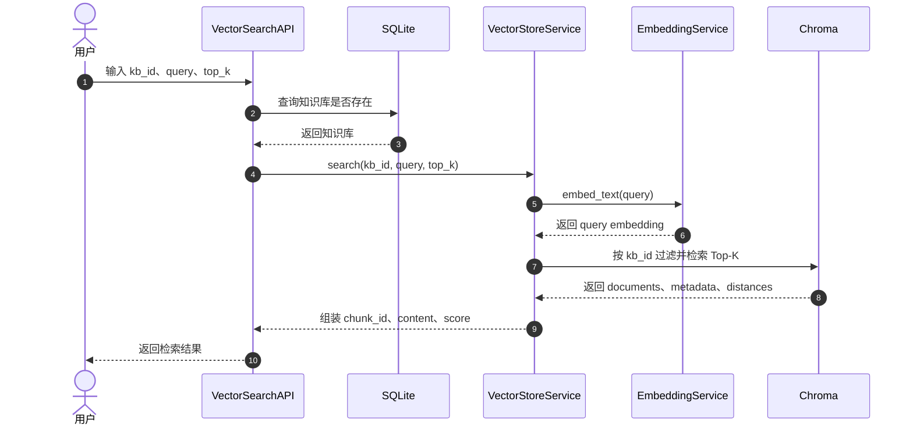

# KnowFlow（知汇）系统 UML 图

本文档基于当前 KnowFlow MVP 后端实现绘制，覆盖知识库管理、文档上传解析、文本分块、向量化入库、向量检索和 RAG 问答流程。

## 1. 用例图



### 用例说明

| 参与者 | 主要用例 | 说明 |
| --- | --- | --- |
| 用户 | 查看知识库、向量检索、RAG 提问、查看回答来源 | 面向学习者，核心行为是选择知识库并提问 |
| 管理员 | 创建知识库、上传文档、查看文档分块 | 负责维护知识库和资料入库 |
| 系统内部 | 解析文档、文本分块、生成 Embedding、写入 Chroma、调用千问 API | 属于自动执行的内部流程 |

## 2. 类图



### 类图说明

| 类/模块 | 作用 |
| --- | --- |
| `KnowledgeBase` | 知识库实体，表示 Spark、Hadoop、Flink 等课程知识库 |
| `Document` | 文档实体，记录上传文件、解析状态和内容预览 |
| `DocumentChunk` | 文档分块实体，是后续向量检索的基本单位 |
| `DocumentParser` | 文档解析服务，支持 `.txt`、`.md`、`.pdf`、`.docx`、`.pptx` |
| `TextChunker` | 文本分块服务，负责 chunk 切分和 token 估算 |
| `EmbeddingService` | 向量生成服务，当前为本地 hashing embedding，后续可替换为 BGE 或百炼 Embedding |
| `VectorStoreService` | Chroma 向量库服务，负责向量写入和相似度检索 |
| `QwenLLMService` | 千问模型调用服务，封装阿里云百炼 OpenAI 兼容接口 |
| `RagService` | RAG 编排服务，负责检索上下文、构造 Prompt、调用 LLM |

## 3. 文档入库顺序图



### 文档入库流程说明

该流程对应接口：

```text
POST /api/kbs/{kb_id}/documents/upload
```

核心结果：

```text
文档被保存到本地 storage/uploads
解析结果被切分为 document_chunk
每个 chunk 被生成 embedding
向量和 metadata 被写入 Chroma
Document 状态变为 finished
```

## 4. RAG 问答顺序图



### RAG 问答流程说明

该流程对应接口：

```text
POST /api/chat
```

请求示例：

```json
{
  "kb_id": 1,
  "question": "Spark DataFrame 和 RDD 有什么区别？",
  "top_k": 5
}
```

返回结果包含：

```text
answer：千问基于检索上下文生成的回答
sources：被检索到的 chunk 来源
usage：千问 API 返回的 token 使用量
```

## 5. 向量检索顺序图



该流程对应接口：

```text
POST /api/kbs/{kb_id}/search
```

该接口主要用于验证向量化入库是否成功，也可以作为 RAG 问答前的调试工具。

## 6. 作业 1.1 RAG 系统增强说明

课程作业给出的基础 RAG 用例图包含用户与管理员两个参与者，核心用例包括：

```text
提问、查看回答与来源、管理历史会话、创建知识库、管理知识库、
上传文档、删除文档、登录、系统设置、修改检索器、修改 LLM、
查看系统状态、查看 token 用量
```

当前 KnowFlow MVP 已经覆盖 RAG 主链路，包括：

```text
创建知识库 -> 上传文档 -> 解析分块 -> 向量化入库 -> 检索 -> 调用千问 -> 返回回答与来源
```

后续为了更完整地对应作业基础用例图，并体现创新性，建议优先扩展：

```text
历史会话
系统状态面板
token 用量统计
检索参数设置
LLM 参数设置
检索过程可视化
低相关度拒答
```

详细的作业要求对照、创新定位、增强版用例图、增强版类图和增强版顺序图，见：

```text
docs/作业要求对照与创新扩展方案.md
```
